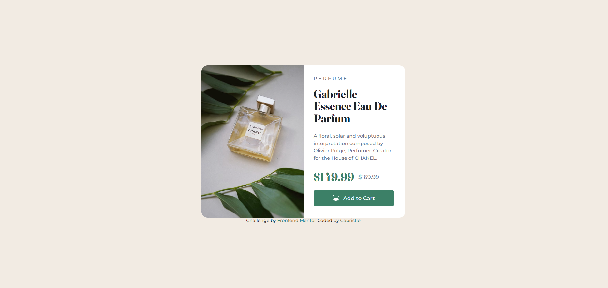
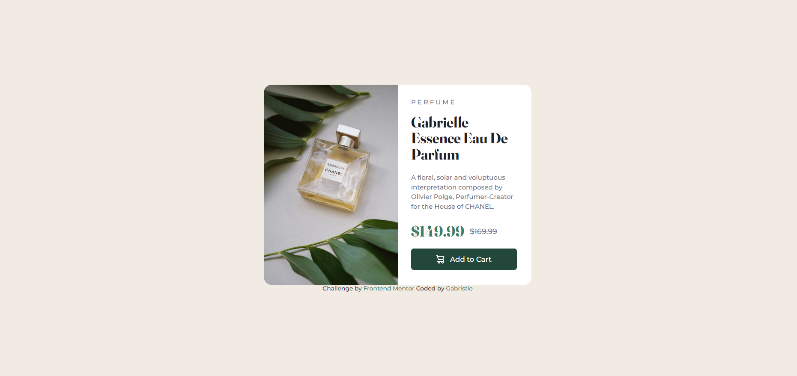

# Frontend Mentor - Product preview card component solution

This is a solution to the [Product preview card component challenge on Frontend Mentor](https://www.frontendmentor.io/challenges/product-preview-card-component-GO7UmttRfa). Frontend Mentor challenges help you improve your coding skills by building realistic projects. 

## Table of contents

- [Overview](#overview)
  - [The challenge](#the-challenge)
  - [Screenshot](#screenshot)
  - [Links](#links)
- [My process](#my-process)
  - [Built with](#built-with)
  - [What I learned](#what-i-learned)
  - [Continued development](#continued-development)
  - [Useful resources](#useful-resources)
- [Author](#author)

## Overview

### The challenge

Users should be able to:

- View the optimal layout depending on their device's screen size
- See hover and focus states for interactive elements

### Screenshot

### Links

- Solution URL: [https://gabristle.github.io/product_preview](https://gabristle.github.io/product_preview)

## My process

### Built with

- Semantic HTML5 markup
- CSS custom properties
- Flexbox

### What I learned

  I've studied html and css primarily when i was 13 years old, stayed without studying a lot of time, until this year. I'm studying again and this is my first project, i'm very happy with the results. I remembered and learned new things about those languages and what i learned more is how works to make responsive pages, the units to do layouts fixed and fluid and other properties of this theme.

### Continued development
  
  
  
### Useful resources

- [CSS Tricks](https://css-tricks.com/snippets/css/a-guide-to-flexbox/) - This amazing article helped me with flexbox on CSS
- [Rafaella Ballerini](https://www.youtube.com/c/rafaellaballerini) - Watching her videos helped me on many questions and inspired me
- [Rocketseat](https://www.youtube.com/c/RocketSeat) - The videos are very didatic, helping me with a lot of doubts on responsiveness

## Author

- Frontend Mentor - [@gabristle](https://www.frontendmentor.io/profile/gabristle)
- Linked In - [Gabriella Costa](https://www.linkedin.com/in/gabriella-costa-222428245/)
